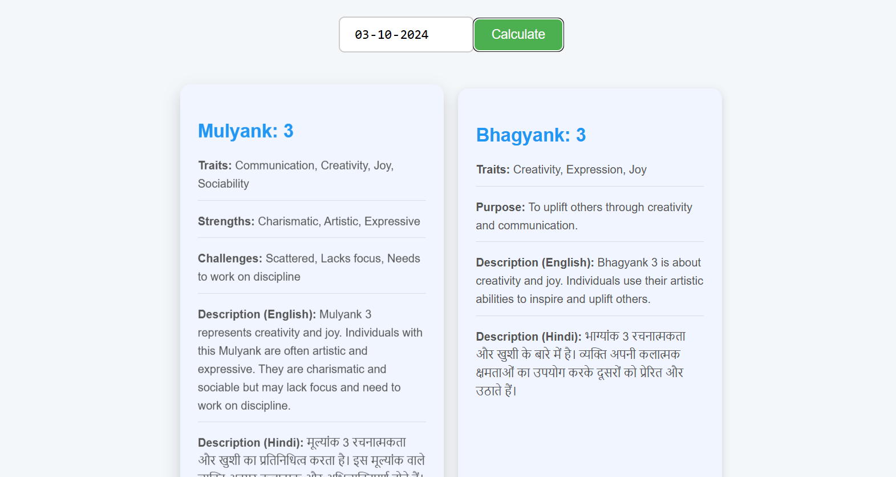

# Numerology Calculator - React App

The **Numerology Calculator** helps users discover their **Mulyank** (Root Number) and **Bhagyank** (Destiny Number) by entering their birthdate. This app provides a unique approach to numerology, helping users gain insights into personality, destiny, and life path.

Live Demo: [numerologycalc.netlify.app](https://numerologycalc.netlify.app/)

## Screenshot



## Features

- **Calculate Mulyank and Bhagyank**: Enter your birthdate, and the app instantly calculates your Root and Destiny numbers.
- **Data Insights**: Receive personalized information on the significance of your numbers based on traditional numerology.
- **React & Vite Powered**: Built using modern technology for fast performance and smooth interactions.

## Getting Started

Follow these instructions to set up and run the project locally.

### Prerequisites

- **Node.js** (>=14.x recommended)
- **Git**

### Installation

1. **Clone the repository**:
   ```bash
   git clone [repository-url]
   cd numerology-calculator
